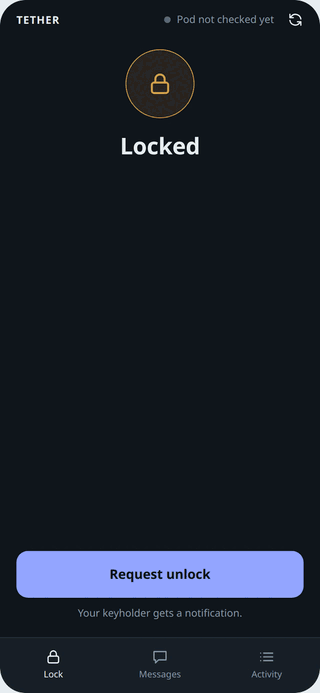

# QIUI Server

A local server for QIUI KeyPods with two roles: a **keyholder** (command line and API, password protected) and a
**wearer** (an installable web app, no password to leak). The server enforces the rules; the wearer's phone only
asks.



*The wearer's installable web app: locked, a timer running, the timer ending, a request, its approval, unlocked.
Real screens, taken against the built-in demo pod.*

## What it does

- **Unlock needs approval.** The wearer can only ask. The keyholder approves, and the approval is single-use and expires.
- **Timers the keyholder controls**: exact or random, pausable, clearable. While a timer runs or is paused nobody unlocks.
  A finished timer only reopens requests.
- **Works away from the server.** Over the server's Bluetooth when the pod is near, or relayed by the wearer's phone
  when it is not. The keyholder can queue a lock or unlock for the next time the pod can be reached.
- **A web app for the wearer** that installs from the browser, keeps the countdown running offline, and sends
  notifications.
- **Short Bluetooth sessions.** Connect, run one command, disconnect.
- **Everything is logged** in a tamper-evident audit log. Passwords are never stored (only keyed hashes), and the QIUI credentials are kept encrypted under the keyholder's password.


## Quick start

```
cargo build --release
qiui-server init                          # keyholder password + recovery PIN
qiui-server config set-client-id          # your QIUI client id (stored encrypted)
qiui-server config set-mac E5:26:D6:6E:B6:8A
qiui-server serve                         # http://127.0.0.1:8443; put HTTPS in front for phones
qiui-server pairing-code                  # one-time code for the wearer's phone
qiui-server status                        # then: approve, timer set 14d, queue lock, audit …
```

The pod must first be **unbound from the QiUi phone app**. Passwords can come from `QIUI_*` environment variables, so
every command is scriptable.

## Documentation

- **[Usage guide](docs/usage.md)**: setup, the keyholder's commands, the wearer's screens, security model and limits,
  troubleshooting, and the full API reference.
- **[RESEARCH.md](RESEARCH.md)**: how QIUI's API and the pod actually behave, including live test results.

## Try it without a pod

```
qiui-server init
qiui-server serve --simulate-pod          # a pretend pod that is always in range
```

Open http://127.0.0.1:8443 in a browser, pair with `qiui-server pairing-code`, and drive the other side with the
keyholder commands. Nothing touches QIUI or real hardware.

## Status

Built and tested: accounts and pairing, lock state machine, timers, approvals, queue, audit log, keyholder CLI, HTTP
API, Bluetooth control (server and phone relay), the wearer's web app and push notifications. The app is exercised end
to end in a real browser by `scripts/e2e.mjs`.

Not yet run for real: the Rust Bluetooth path against the actual pod (it is covered by tests with a fake pod; the
earlier Python scripts and a browser probe did talk to the pod), and push delivery through a real push service to a
real phone.
