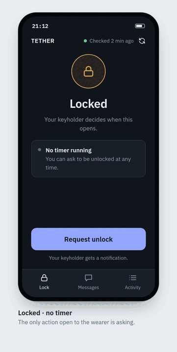
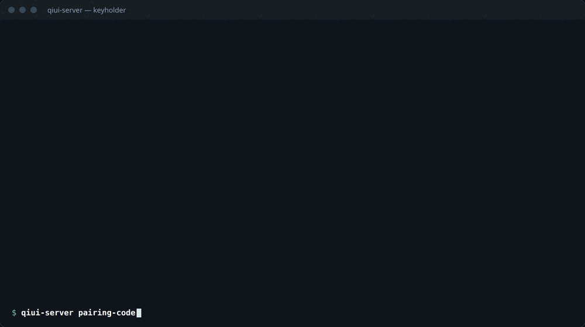

# QIUI Server

A local server for QIUI KeyPods with two roles: a **keyholder** (command line and API, password protected) and a
**wearer** (an installable web app, no password to leak). The server enforces the rules; the wearer's phone only
asks.



*The wearer's app, as designed. The screens are mockups; the app itself is the next piece of work. Everything it
will do already works through the API.*

## What it does

- **Unlock needs approval.** The wearer can only ask. The keyholder approves, and the approval is single-use and expires.
- **Timers the keyholder controls**: exact or random, pausable, clearable. While a timer runs or is paused nobody unlocks.
  A finished timer only reopens requests.
- **Works away from the server.** Over the server's Bluetooth when the pod is near, or relayed by the wearer's phone
  when it is not. The keyholder can queue a lock or unlock for the next time the pod can be reached.
- **Short Bluetooth sessions.** Connect, run one command, disconnect.
- **Everything is logged** in a tamper-evident audit log. Passwords are never stored; the database holds only keyed hashes.



## Quick start

```
cargo build --release
qiui-server init                          # keyholder password + recovery PIN
qiui-server config set-client-id          # your QIUI client id
qiui-server config set-mac E5:26:D6:6E:B6:8A
qiui-server serve                         # http://127.0.0.1:8443; put HTTPS in front for phones
qiui-server pairing-code                  # one-time code for the wearer's phone
qiui-server status                        # then: approve, timer set 14d, queue lock, audit …
```

The pod must first be **unbound from the QiUi phone app**. Passwords can come from `QIUI_*` environment variables, so
every command is scriptable.

## Documentation

- **[Usage guide](docs/usage.md)**: setup, the keyholder's commands, the wearer's screens, security model and limits,
  troubleshooting, and the full API reference.
- **[RESEARCH.md](RESEARCH.md)**: how QIUI's API and the pod actually behave, including live test results.

## Status

Built and tested: accounts and pairing, lock state machine, timers, approvals, queue, audit log, keyholder CLI, HTTP
API, Bluetooth control (server and phone relay). Bluetooth against the real pod has been exercised with the earlier
Python scripts and a browser probe; the Rust Bluetooth path is covered by tests with a fake pod and still needs its
first run against hardware. Still to build: the wearer's web app and push notifications.
