# qiui-server usage guide

A local server that lets a **keyholder** control a QIUI KeyPod worn by a **wearer**, with the rules enforced on the
server rather than on the wearer's phone.

> **What exists today.** Everything described here is built and tested: the server, the keyholder command line, the
> HTTP API, Bluetooth control (through the server or relayed by the wearer's phone), the audit log, the wearer's
> installable web app and push notifications. Two things have not yet been run for real: the Rust Bluetooth path
> against the actual pod (it is covered by tests with a fake pod), and push delivery through a real push service to a
> real phone. The wearer screenshots below are taken from the running app against a **simulated** pod
> (`--simulate-pod`), driven by an automated browser test.

Contents: [How it works](#how-it-works) · [Setup](#setup) · [Keyholder guide](#keyholder-guide) ·
[Wearer guide](#wearer-guide) · [Security model and limits](#security-model-and-limits) ·
[Troubleshooting](#troubleshooting) · [API reference](#api-reference) · [Files and settings](#files-and-settings)

---

## How it works

```
 wearer's phone (web app)                        keyholder (CLI or API)
        │  HTTPS                                        │  HTTP on the server machine
        ▼                                               ▼
   ┌───────────────────────────  qiui-server  ───────────────────────────┐
   │  rules · timer · approvals · queue · audit log · accounts · SQLite  │
   └───────────────┬─────────────────────────────────────┬───────────────┘
                   │ Bluetooth (server's adapter)        │ HTTPS
                   ▼                                     ▼
                KeyPod  ◄── Bluetooth (phone relay) ── phone      QIUI cloud (mints command bytes)
```

- **The server decides everything.** The wearer's phone only ever asks; it never holds a rule.
- **QIUI's cloud mints the command bytes** for every lock, unlock and handshake. The server calls it; the wearer's
  app never talks to it and never sees your QIUI credentials.
- **Bluetooth is used in short sessions**: connect, handshake, one command, disconnect. Nothing stays connected.

### What each side can do

| | Wearer | Keyholder |
|---|---|---|
| See lock state, timer countdown, messages | ✔ | ✔ |
| Ask to be unlocked | ✔, unless a timer is running or paused | – |
| Approve or deny a request | ✘ | ✔ |
| Unlock | only after a live approval | ✔, unless a timer is running or paused |
| Lock | ✔ after unlocking | ✔ any time |
| Set, roll, pause, resume, clear the timer | ✘ | ✔ |
| Queue a lock or unlock for later | ✘ | ✔ |
| Send messages | ✘ | ✔ |
| Read the audit log | ✘ | ✔ |

A timer that finishes only **reopens requests**. Nothing ever unlocks by itself, and the wearer can never unlock
without approval.

---

## Setup

### 1. Prerequisites

- A Linux machine with a Bluetooth adapter that stays near the pod (about 10 m). A laptop works if it never sleeps.
- Rust (edition 2024), plus the BlueZ and D-Bus development headers (`libdbus-1-dev` on Debian/Ubuntu).
- A QIUI Open Platform **client id** (from developers.qiuitoy.com).
- The KeyPod **unbound from the QiUi phone app**. A pod can belong to the app or to the Open Platform, never both.
  If it is still in the app you will see QIUI error `500059`.

```
cargo build --release          # binary: target/release/qiui-server
```

### 2. Create the keyholder account

```
qiui-server init
```

You choose a **password** (at least 10 characters) and a **recovery PIN** (6 to 12 digits). Neither is stored: only
keyed hashes are. The PIN is the only way to reset a forgotten password, and only from this machine.

### 3. Tell it about QIUI and the pod

```
qiui-server config set-client-id        # prompts, hidden
qiui-server config set-mac E5:26:D6:6E:B6:8A
qiui-server config show                 # secrets are masked
```

Coming from the old Python scripts? `qiui-server config import-env ~/qiui-keypod/.qiui_pod_env` copies the client
id and API key across. Credentials live in `config.json` in the data directory, readable only by you. That is file
permissions, not encryption.

Check the pod is reachable (wake it first by pressing its button; it sleeps after about 10 minutes):

```
qiui-server sync
```

### 4. Run the server

```
qiui-server serve                       # http://127.0.0.1:8443, this machine only
```

The server speaks plain HTTP and refuses to bind a public address unless you pass `--allow-remote`. Phones need
HTTPS (the web app and Bluetooth in the browser both require it), so put a TLS front in front of it. With
Tailscale, `tailscale serve` will publish `127.0.0.1:8443` over HTTPS on your tailnet (check Tailscale's docs for
the exact command for your version); a Cloudflare Tunnel also works.

**Trying it without a pod.** `qiui-server serve --simulate-pod` runs the whole thing against a pretend pod that is
always in range and always obeys (add `--simulate-out-of-range` to make the phone's Bluetooth the only way in). It
prints a warning and touches neither QIUI nor any hardware. It is what the screenshots in this guide were taken with.

A typical always-on setup (not tested here): a systemd user service running `qiui-server serve`, `loginctl
enable-linger $USER`, and the laptop configured not to suspend when the lid closes (`HandleLidSwitch=ignore` in
`/etc/systemd/logind.conf`).

### 5. Open the wearer's app

The app is served at the same address as the API. On the wearer's phone open the server's HTTPS address in the
browser and choose **Add to Home Screen**. It then opens like an app, works offline for the countdown, and can
receive notifications.

### 6. Pair the wearer's device

```
qiui-server pairing-code
```

Read the code to the wearer. It works once, for 10 minutes, and a new code replaces it. Only **one device** can be
paired at a time; to swap phones, `qiui-server devices` then `qiui-server revoke-device <id>` first.

---

## Keyholder guide

Every command below signs in for you. Give the password with `QIUI_KEYHOLDER_PASSWORD` (best for scripts) or
`--password` (visible in `ps` and shell history, so the tool warns you), or type it when asked.


*This session is real output from the built binary against a test server with no pod attached.*

### Commands

| Command | What it does |
|---|---|
| `status` | Lock state, timer, approval, queued command, when the pod was last reached, the paired device |
| `approve [--minutes N]` | Approve the wearer's request (default 15 minutes, one use) |
| `deny` | Deny a request, or revoke an approval that has not been used |
| `unlock` / `lock` | Do it now over the server's Bluetooth. `unlock` is refused under a timer |
| `sync` | Reach the pod over Bluetooth and refresh "last reached" |
| `timer set <duration>` | Start a timer of an exact length: `14d`, `36h`, `2d12h30m`, `90m` |
| `timer roll <min> <max>` | Start a timer of random length in that range. The wearer never sees the range or the roll |
| `timer add <duration>` | Add time to the running or paused timer, e.g. `2h`. With no active timer it starts one |
| `timer add-roll <min> <max>` | Add a random amount in that range. The wearer never sees how much |
| `timer pause` / `resume` / `clear` | Freeze, restart or remove the timer |
| `queue lock` / `queue unlock` / `queue cancel` | Have a command carried out the next time the pod can be reached |
| `message "text"` | Send the wearer a message (up to 1000 characters) |
| `audit [--limit N]` | The audit log, newest first |
| `pairing-code`, `devices`, `revoke-device <id>` | Manage the wearer's device |
| `reset-password` | Reset the password with the recovery PIN |
| `config …` | QIUI credentials and pod address |

`lock`, `unlock` and `sync` also work with the server **stopped**: the CLI then talks to the pod directly, applying
the same rules. That is your fallback if the server is down. The other commands need the server running.

### Timers

- A timer counts down on the **server's clock**, so changing the phone's clock does nothing.
- **While a timer is running or paused, nobody unlocks**, you included. Pausing is not enough: to unlock you must
  `timer clear` first.
- **Adding time** (`timer add`, `timer add-roll`) makes a running timer end later, or gives a paused timer more time
  while leaving it paused. A timer cannot be made longer than 365 days in total. If there is no active timer (none,
  or one that has ended), `add` simply starts a new one, exactly like `timer set`.
- Starting a timer **cancels a pending request or approval**, because they were granted under different rules.
  You can see this in the demo above (`approval_revoked`).
- When the timer ends, the wearer's **Request unlock** button reopens. They still need your approval.

### Approvals

An approval lasts a set time (15 minutes by default) and can be used once. If it lapses, or a timer starts, it is
gone and the wearer must ask again. An unlock attempt that fails (for example the pod is out of range) does **not**
use the approval up.

### When the pod is out of range: the queue

If you want the pod locked (or unlocked) and it is not near the server, `queue lock` holds the command. It runs:

1. **Automatically**, within about 45 seconds of the pod coming into the server's range, or
2. **From the wearer's phone**, the next time they open the app and connect over Bluetooth.

The rules are checked again when it runs, so a queued unlock is **dropped** if a timer has started since. One
command can be queued at a time.

### The audit log

Every change is recorded: who did it (`keyholder`, `wearer`, `system`, `local-cli`), what, and when. Rolled timers
store both the range and the result. Unlocks and locks record `"via"`: `server`, `phone` or `direct`.

Each row includes a hash of the row before it, so editing or deleting a row is detected: `audit` warns you if the
chain is broken. This catches casual tampering. It cannot stop someone who can rewrite the whole database.

Two events deserve attention:

- `relay_unlock_issued`: unlock bytes were handed to the wearer's phone (see [limits](#security-model-and-limits)).
- `control_lost`: QIUI says the pod is now bound outside this server, for example the wearer re-paired it to the
  QiUi app. The server cannot prevent that; it can only tell you.

### Forgotten password

```
qiui-server reset-password        # asks for the recovery PIN, then a new password
```

Run it on the server machine. Wrong PINs lock out for growing periods, a successful reset signs out every
keyholder session, and the reset is recorded in the audit log as `local-cli`.

---

## Wearer guide


*Locked, a timer running, the timer ending, a request, its approval, unlocked. Real screens from the app.*

### Installing and pairing

Open the server's HTTPS address in the phone's browser, choose **Add to Home Screen**, then enter the pairing code
the keyholder gives you. A wrong code is refused with a message and counts toward a lockout.


### The button

The main button always says what is possible right now:

| State | Button | Why |
|---|---|---|
| Locked, no timer | **Request unlock** | You may ask at any time |
| Locked, timer running or paused | *Unlock requests closed* (greyed out) | Only the keyholder can change the timer |
| Timer ended | **Request unlock** | Asking is allowed again |
| Request sent | *Waiting for approval* (**Cancel request** below it) | The keyholder decides |
| Approved | **Unlock** | Single use, and it times out |
| Unlocked | **Lock** | Ends the unlock; the pod also locks itself soon after opening |

<p>
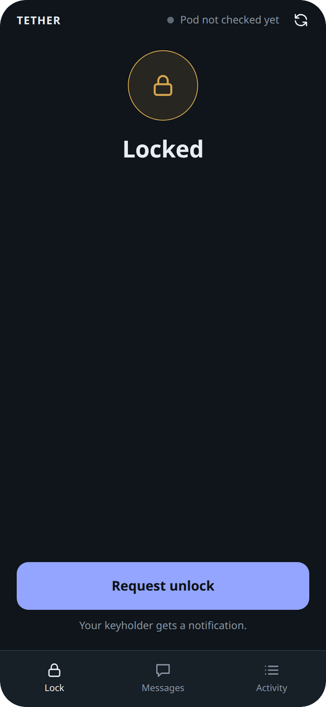
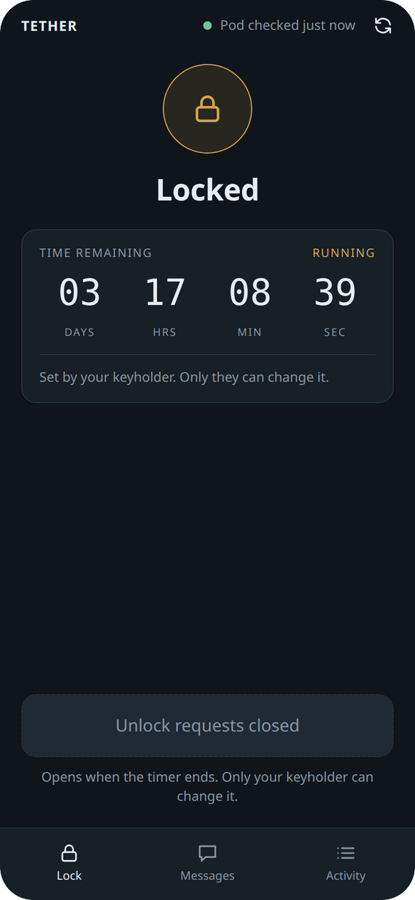
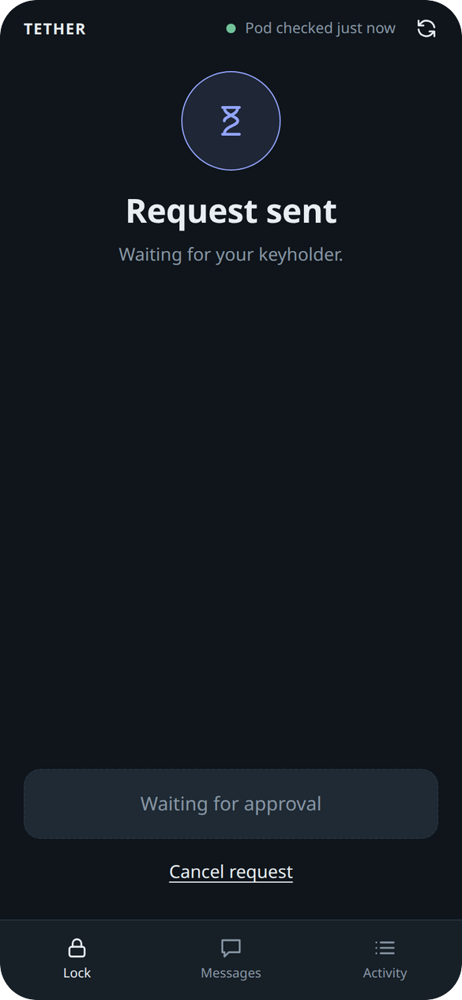
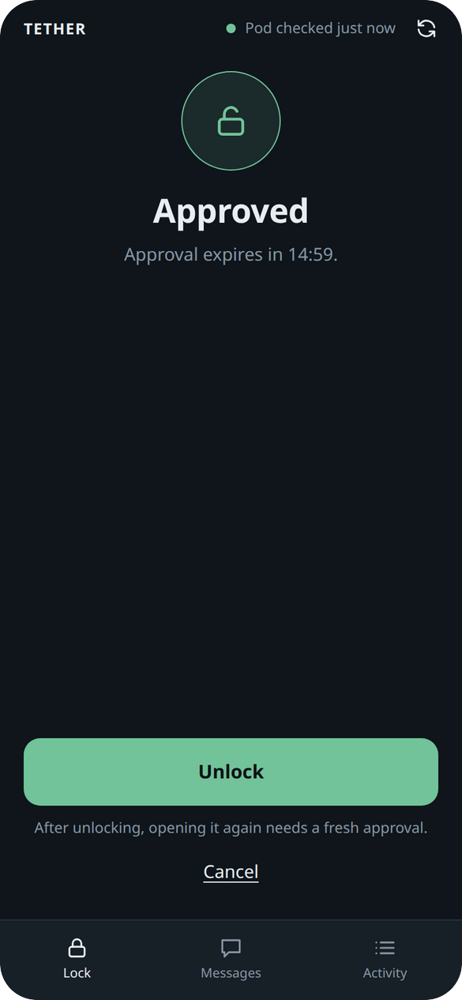
</p>

### The timer and the sync button

The countdown shows days, hours, minutes and seconds, whether the keyholder set an exact time or rolled a random
one. It is drawn from the **server's clock**, so changing the phone's clock does nothing. The circular arrows at the
top right refresh the app from the server and ask it to check the pod; "Pod checked … ago" says when the pod itself
was last reached, because the pod can only be read over Bluetooth.

If the phone goes offline the countdown keeps running from the last reading, and if it reaches zero it is marked
**Ended · unconfirmed**: the keyholder may have changed it since. You can still tap **Request unlock**; the request
is held and sent when you reconnect, and the server checks the timer itself, so it is only accepted if the timer
really ended.

<p>
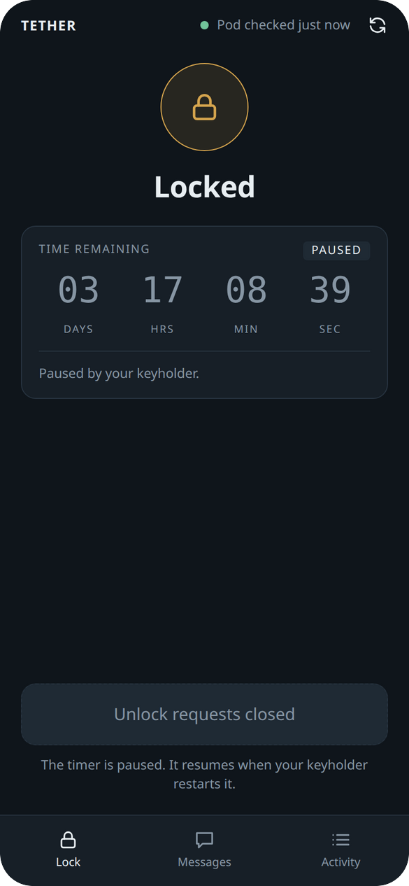
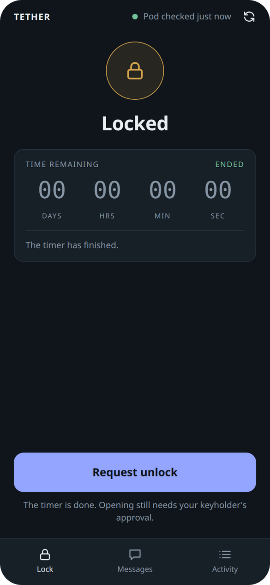
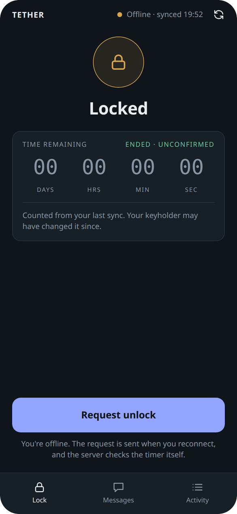
</p>

### Unlocking: server or phone

- **Pod within range of the server:** tapping **Unlock** opens it directly. Nothing to connect.
- **Pod out of range:** the app says so and offers **Connect over Bluetooth**, which uses **this phone's Bluetooth**.
  Hold the phone within a metre or two of the pod and keep the screen open. (It asks for a second tap because the
  browser only allows a Bluetooth connection straight after a tap.) The phone disconnects as soon as the command is done.

<p>
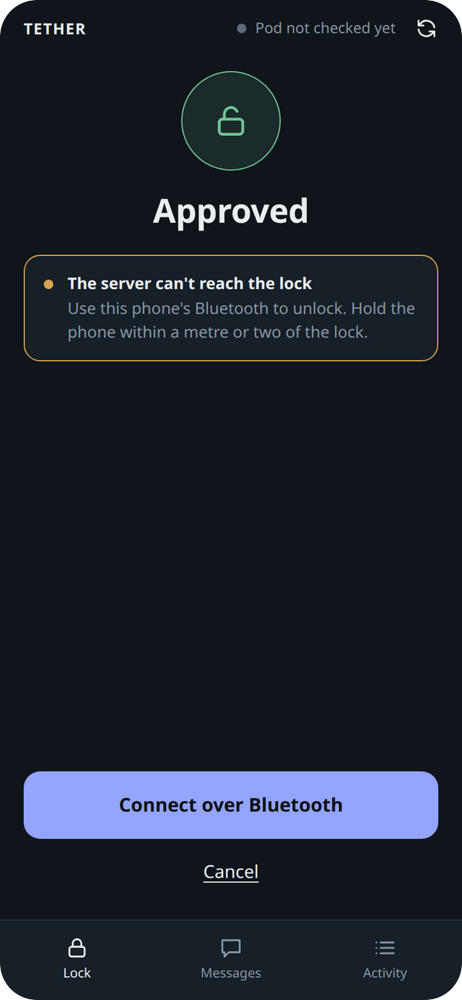
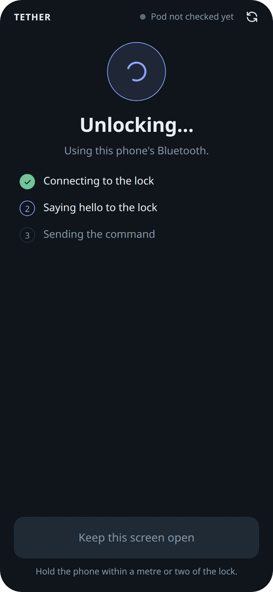
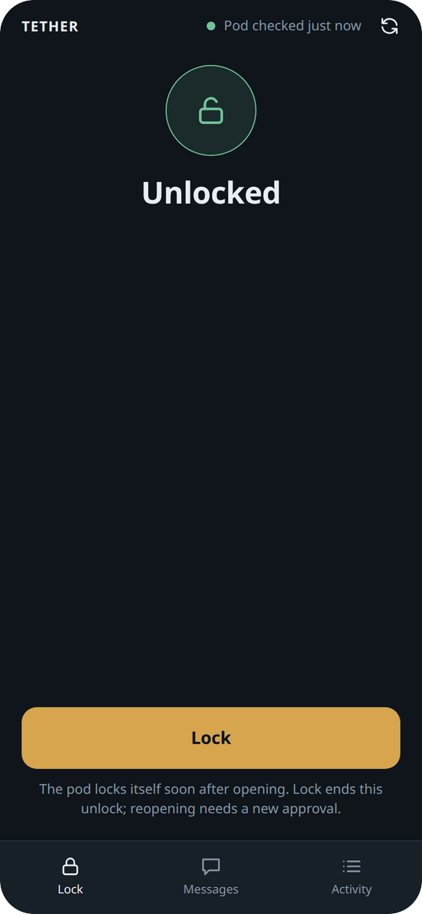
</p>

| Phone | Unlock away from the server |
|---|---|
| Android, Chrome | ✔ |
| iPhone, Safari or Chrome | ✘. Apple gives every iOS browser an engine without Web Bluetooth |
| iPhone, a Web Bluetooth browser app (for example *Bluetooth Browser*) | Probably; **not tested** |

On a phone that cannot use Bluetooth the app says so, and you can still unlock whenever the pod is within range of
the server.

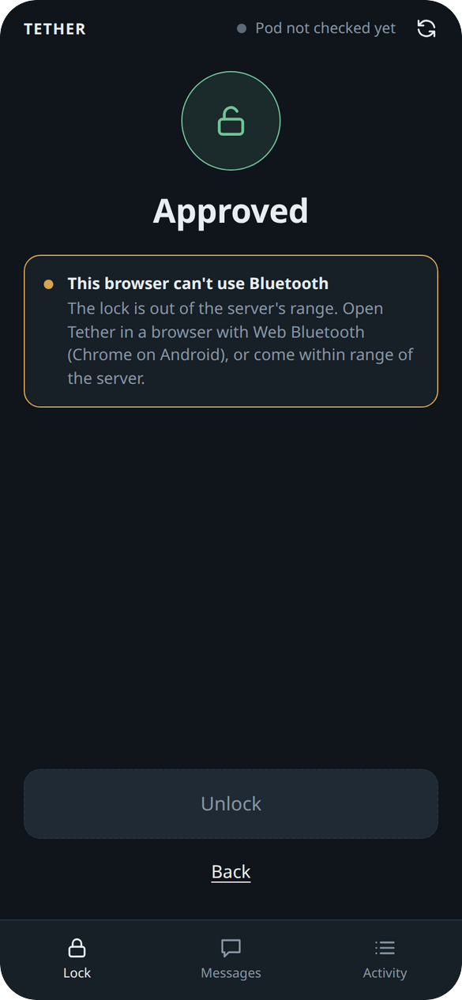

### Messages, activity and queued commands

The **Messages** tab shows what the keyholder has sent. **Activity** tells the story of your lock: requests,
approvals, timer changes (including time being added), unlocks and locks, and who did each. It never shows how a random timer was rolled, or how much time was added. If the
keyholder queued a lock or unlock while you were out of range, a card offers **Connect and apply**.

<p>
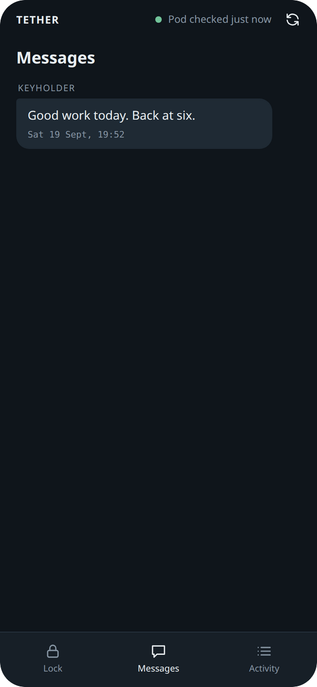
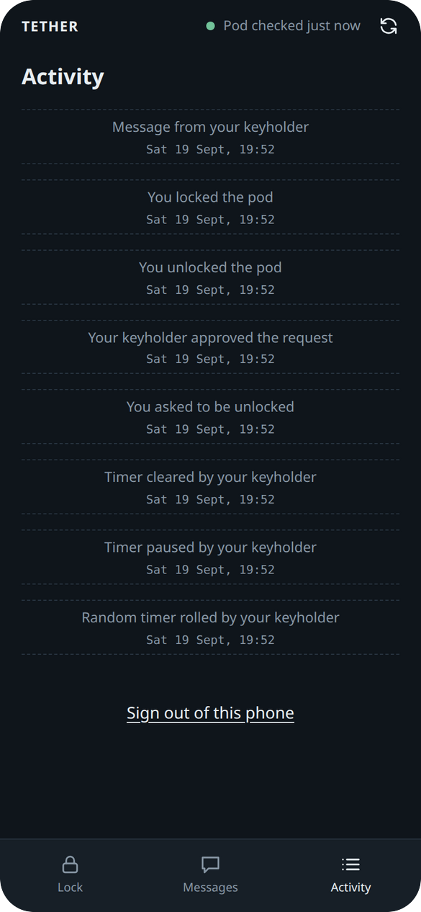
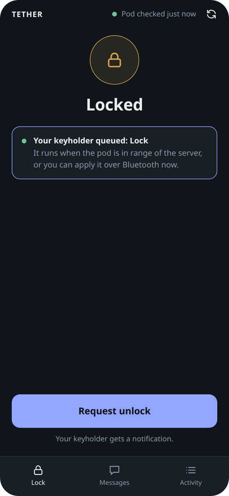
</p>

### Notifications

When the server has notifications set up, the app offers **Turn on notifications**. You are then told when your
keyholder approves or turns down a request, sends a message (the text is shown, so it can appear on your lock
screen), starts, extends, pauses or clears a timer, or queues a command, and when a timer finishes. Things you did yourself
are never notified.

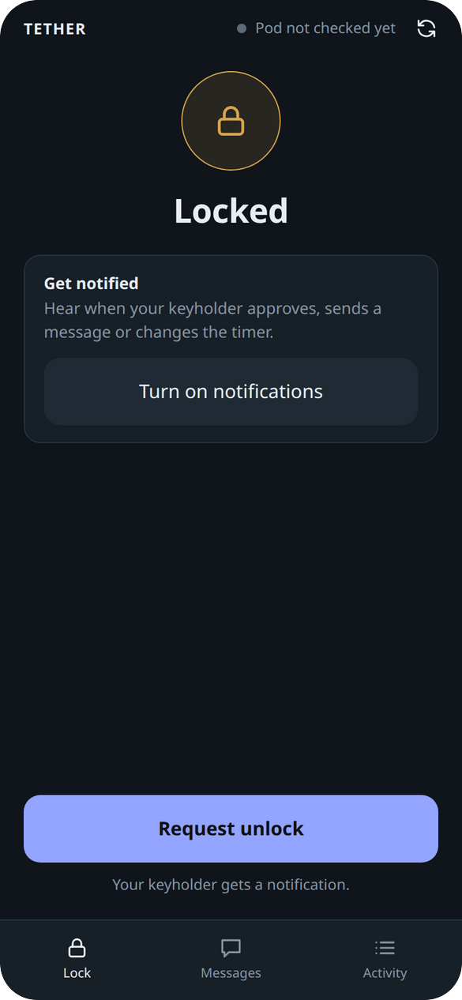

- **Android, Chrome:** works from the browser or the installed app.
- **iPhone (iOS 16.4 or later):** only from the app **added to the Home Screen** from Safari.
- The server signs pushes with its own key (`vapid.key`) and encrypts each one for your phone, so the push service
  (Google, Mozilla, Apple) cannot read them. Give push services a contact address with
  `qiui-server config set-push-contact mailto:you@example.com`; Apple in particular can refuse pushes without one.
- Delivery through a real push service has not been tried yet. If nothing arrives, the audit log and
  `qiui-server serve`'s output are the places to look.

---

## Security model and limits

This is what the design does and does not protect against. Read it before relying on it.

**Held by the server, not the phone.** Timer, approvals, and every unlock decision are enforced server-side. A
wearer token is refused on every keyholder route (a test tries each one).

**Secrets.** Passwords and the recovery PIN are Argon2id hashes keyed with a *pepper* stored outside the database;
session tokens and pairing codes are stored only as SHA-256 hashes. A copied database reveals none of them. Back
up `pepper.key` together with the database, or every stored hash becomes unverifiable. Failed logins, PIN guesses
and pairing guesses lock out for growing periods.

**The web app.** It is served with a strict Content-Security-Policy (no inline scripts or styles, and it may only talk to
this server), and the device token lives in the browser's local storage. Push notification URLs come from the
wearer's device, so the server only sends to https addresses on the known push services (Google, Mozilla, Apple,
Microsoft) and never follows redirects; otherwise a wearer could aim the server at something inside your network.

**Not protected:**

- **Anyone with a shell on the server machine** can reset the password (with the PIN), read the QIUI credentials,
  and use the CLI. Treat the machine as keyholder-only.
- **Phone relay leaks unlock bytes to the wearer's phone.** Testing showed the bytes only work on the connection
  they were made for, and rarely on another (a few hundred possible states, so roughly a 1-in-several-hundred
  chance per reconnect for someone holding captured bytes). Exploiting that needs the wearer to extract the bytes
  (browser developer tools, or an Android Bluetooth log analysed on a computer) and then reconnect many times. It
  is an accepted risk for this design; every issue of unlock bytes is logged as `relay_unlock_issued`. Unlocks over
  the **server's** Bluetooth never expose the bytes.
- **The wearer can take the pod away from the server** by binding it to another platform or app. This cannot be
  prevented, only detected (`control_lost`).
- **Physical access.** This is software protecting a latch. It does not make the pod tamper-proof, and it cannot
  release a pod whose battery has died or whose server is down; keep a plan for getting out (the CLI works without
  the server, and the pod battery level is not reported by this model).
- **The audit chain** detects edits, not a complete rewrite by someone with database write access.

The evidence behind these statements is in [`RESEARCH.md`](../RESEARCH.md) §10.

---

## Troubleshooting

| You see | Meaning and fix |
|---|---|
| "the pod is not within Bluetooth range of the server" | The pod is asleep (press its button; it sleeps after about 10 minutes idle) or too far from the server's adapter |
| First connect after waking fails, second works | Normal for this pod; the server retries once automatically |
| `control_lost` / "bound outside this server" | QIUI codes `500025` or `500059`: the pod is bound to another platform or the QiUi app. Unbind it there, then it can be used again |
| "QIUI credentials are not configured" | Run `qiui-server config set-client-id` and restart `serve` |
| QIUI error `500032` / `500033` (no command returned) | QIUI has no session state for the pod yet: a handshake reply must be decrypted first. The server always does this; if you see it, retry after a fresh `sync` |
| A timer blocks `unlock` | Working as designed: `timer clear` first |
| `unlock` refused, "wrong state" | The wearer has not asked, or the approval lapsed |
| Lock state looks wrong after the pod locked itself | The pod re-locks itself soon after opening. `lock` (keyholder) or the wearer's **Lock** button brings the record back in line |
| `audit` warns the chain is broken | Rows were edited or deleted. Treat the log as untrustworthy from the first bad row |
| No notifications | Check the app shows *notifications on* (not the offer), the browser allows them, and on iPhone that the app is on the Home Screen. Push has not been verified against a real push service yet |
| The app shows old data | It refreshes every 20 seconds and when opened. The circular arrows refresh it now. Offline, it shows what it last saw and says so |
| Battery never shows | The KeyPod API reports 0, which we treat as "not reported" |

---

## API reference

All bodies are JSON. Errors look like `{"error": "…", "code": "…"}` (`code` appears for cases a client may want to
branch on: `out_of_range`, `control_lost`, `pod_timeout`, `pod_error`, `cloud_error`, `relay_expired`, `push_unavailable`). Every
response carries `Cache-Control: no-store`. Authenticate with `Authorization: Bearer <token>`.

### Sign-in

| Method and path | Body | Result |
|---|---|---|
| `POST /api/keyholder/login` | `{"password"}` | `{"token", "expires_in_secs"}` (8 hours). Throttled: `429` with `retry_after_secs` |
| `POST /api/wearer/pair` | `{"code", "device_name"}` | `{"token"}` for that device (about 400 days, until revoked) |

### Keyholder routes (`/api/keyholder/…`)

| Path | Method | Body | Purpose |
|---|---|---|---|
| `state` | GET | | Lock, timer, approval, queue, pod info, paired device |
| `approve` | POST | `{"ttl_minutes"?}` (1 to 240) | Approve the request |
| `deny` | POST | | Deny or revoke |
| `unlock`, `lock` | POST | | Do it over the server's Bluetooth |
| `sync` | POST | | Refresh pod info over Bluetooth (`in_range` false is a normal answer) |
| `timer` | POST | `{"duration_secs"}` | Exact timer |
| `timer/roll` | POST | `{"min_secs","max_secs"}` | Random timer; the response adds `rolled_secs` |
| `timer/add` | POST | `{"duration_secs"}` | Add time; starts a timer if none is active. Refused past 365 days in total |
| `timer/add-roll` | POST | `{"min_secs","max_secs"}` | Add a random amount; the response adds `rolled_secs` |
| `timer/pause`, `timer/resume`, `timer/clear` | POST | | |
| `queue` | POST | `{"command": "lock"\|"unlock"}` | Queue a command |
| `queue/cancel` | POST | | |
| `messages` | POST | `{"body"}` | Message the wearer |
| `audit?limit=N` | GET | | `{"chain_intact", "entries"}` |
| `pairing-code` | POST | | `{"code", "expires_ms"}` |
| `devices` | GET | | Paired devices |
| `devices/{id}/revoke` | POST | | Sign a device out |
| `password` | POST | `{"current_password","new_password"}` | Change password; signs everyone out |
| `logout` | POST | | |

### Wearer routes (`/api/wearer/…`)

| Path | Method | Purpose |
|---|---|---|
| `state` | GET | `server_time_ms`, `lock`, `approval_expires_ms`, `timer`, `unread_messages`, `queued_command`, `pod`. The rolled value and range are never included |
| `request-unlock`, `cancel-request` | POST | Ask, or withdraw |
| `unlock`, `lock` | POST | Over the server's Bluetooth. `409` with `code: out_of_range` means use the phone relay |
| `sync` | POST | Refresh pod info; rate-limited (`cooldown: true`) |
| `messages` | GET | Messages, marked read |
| `relay/start`, `relay/reply` | POST | Phone-relayed Bluetooth (below) |
| `activity` | GET | The wearer's own story: requests, approvals, timer changes, unlocks, locks. Actor and route only, never details |
| `push/key` | GET | The server's VAPID public key (`404 push_unavailable` if notifications are not set up) |
| `push/subscribe` | POST | `{"endpoint","keys":{"p256dh","auth"}}`. Endpoint must be https on a known push service |
| `push/unsubscribe` | POST | |

### Phone relay

The phone only carries bytes; the server drives the sequence and decides when a command may be minted.

1. `POST /api/wearer/relay/start {"intent": "unlock"|"lock"|"status"|"queued"}` → `{"session_id", "cmd"}`.
   The rules for the intent are checked first, so an unapproved unlock never gets as far as a handshake.
2. Connect to the pod over Bluetooth and write `cmd` to characteristic `0000fff1-…`. The pod answers on `0000fff2-…`.
3. `POST /api/wearer/relay/reply {"session_id", "hex": "<pod reply>"}`.
   - `{"done": false, "cmd": "…"}`: write this next (the unlock or lock bytes), then `reply` again with the pod's answer.
   - `{"done": true, …state}`: finished. **Disconnect now.**
4. A session belongs to one device, lasts two minutes, and one device has at most one at a time.

### A complete wearer flow with curl

```
# keyholder: sign in and make a pairing code
KH=$(curl -s -X POST $S/api/keyholder/login -H 'content-type: application/json' -d '{"password":"…"}' | jq -r .token)
CODE=$(curl -s -X POST $S/api/keyholder/pairing-code -H "authorization: Bearer $KH" | jq -r .code)

# wearer: pair, ask
W=$(curl -s -X POST $S/api/wearer/pair -H 'content-type: application/json' -d "{\"code\":\"$CODE\",\"device_name\":\"phone\"}" | jq -r .token)
curl -s -X POST $S/api/wearer/request-unlock -H "authorization: Bearer $W"

# keyholder: approve; wearer: unlock (server's Bluetooth)
curl -s -X POST $S/api/keyholder/approve -H "authorization: Bearer $KH" -H 'content-type: application/json' -d '{}'
curl -s -X POST $S/api/wearer/unlock -H "authorization: Bearer $W"
```

---

## Files and settings

Everything lives in the **data directory**: `--data-dir`, else `$QIUI_DATA_DIR`, else `~/.local/share/qiui-server`.
The directory is mode 0700 and the files 0600; the server refuses to start if they are looser.

| File | Contents |
|---|---|
| `qiui.db` | SQLite: lock state, accounts, sessions, queue, messages, audit log (WAL mode) |
| `pepper.key` | 32 random bytes that key the password hashes. Back it up with the database |
| `config.json` | QIUI client id, API key, pod address, push contact |
| `vapid.key` | The server's push-signing key, created on first run |

QIUI's 12-hour platform token is kept **in memory only** and renewed about 30 minutes before it expires (checked every
10 minutes). QIUI returns the same token until it expires, so fetching again after a restart is equivalent, and no
live credential ever sits in the database. If renewal fails, `platform_token_failed` is written to the audit log.

| Variable | Used by |
|---|---|
| `QIUI_KEYHOLDER_PASSWORD` | `init`, `lock`, `unlock`, `sync`, and every keyholder command |
| `QIUI_RECOVERY_PIN`, `QIUI_NEW_PASSWORD` | `init`, `reset-password` |
| `QIUI_CLIENT_ID`, `QIUI_API_KEY` | `config set-client-id`, `config set-api-key` |
| `QIUI_DATA_DIR` | Where the state lives |
| `QIUI_SERVER` | Address the keyholder commands talk to (default `http://127.0.0.1:8443`) |

---

## Development

```
cargo test                          # the server: state machine, accounts, API, push, Bluetooth sessions (with fakes)
node --test web/test                # the app's logic: countdown, button rules, the phone-relay loop
```

`scripts/e2e.mjs` runs the real server binary in demo mode and drives the real app in a real browser: pairing,
requesting, approving, unlocking, the offline countdown, the phone-relay flow (with a fake Bluetooth radio), a
browser without Bluetooth, and the notifications offer. It asserts what it sees and takes the screenshots in this
guide.

```
cargo build
npm i playwright-core
CHROME=/path/to/chrome node scripts/e2e.mjs        # SHOTS_DIR=… to keep the screenshots
```

The wearer's app is plain JavaScript with no build step, in `web/`. It is compiled into the binary, so changing it
means rebuilding.
